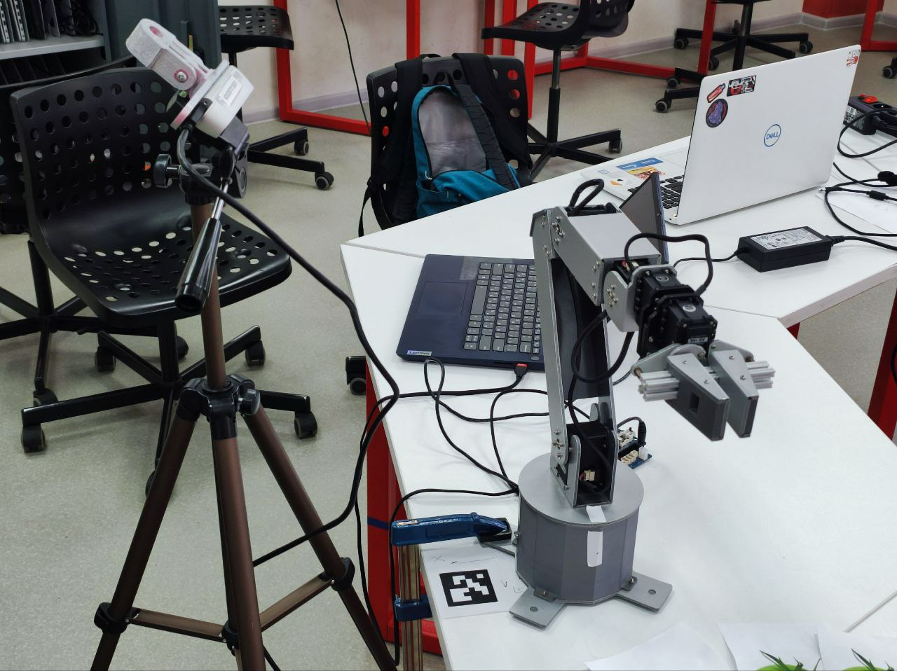

Целью проекта стало создание прототипа системы для автоматического распознавания и удаления испорченных томатов

Система состоит из камеры глубины «Intel Realsence» способной определять расстояние до объектов, манипулятора «Applied Robotics» с модернизированным захватом для отрезания испорченных плодов, нейросети Yolo, Обученной на выбранном датасете и программе, написанной на Python.

Система начинается с калибровки, в ходе которой определяется матрица трансформации для перевода координат камеры в мировую систему координат манипулятора. Далее камера фиксирует изображение, на котором модель YOLO обнаруживает испорченный томат, а камера глубины измеряет расстояние до него. Полученные координаты преобразуются из системы камеры в мировые с использованием заранее вычисленной матрицы трансформации. После этого манипулятор получает точные координаты томата, перемещается к нему и срезает плод. Важно отметить, что система реагирует только на испорченные томаты, игнорируя зрелые и незрелые плоды.

------------------------------------------------------------------------------------------------------------------------------

The goal of the project was to develop a prototype system for the automatic detection and removal of spoiled tomatoes.  

The system consists of an «Intel RealSense» depth camera capable of measuring the distance to objects, an "Applied Robotics" manipulator with a modified gripper for cutting off spoiled fruits, a YOLO neural network trained on a selected dataset, and a program written in Python.  

The process begins with calibration, during which a transformation matrix is determined to convert the camera's coordinates into the manipulator's world coordinate system. Next, the camera captures an image where the YOLO model detects a spoiled tomato, while the depth camera measures the distance to it. The obtained coordinates are transformed from the camera's system to the world coordinates using the precomputed transformation matrix. The manipulator then receives the precise coordinates of the tomato, moves to its location, and cuts the fruit. Importantly, the system responds only to spoiled tomatoes, ignoring ripe and unripe ones.

